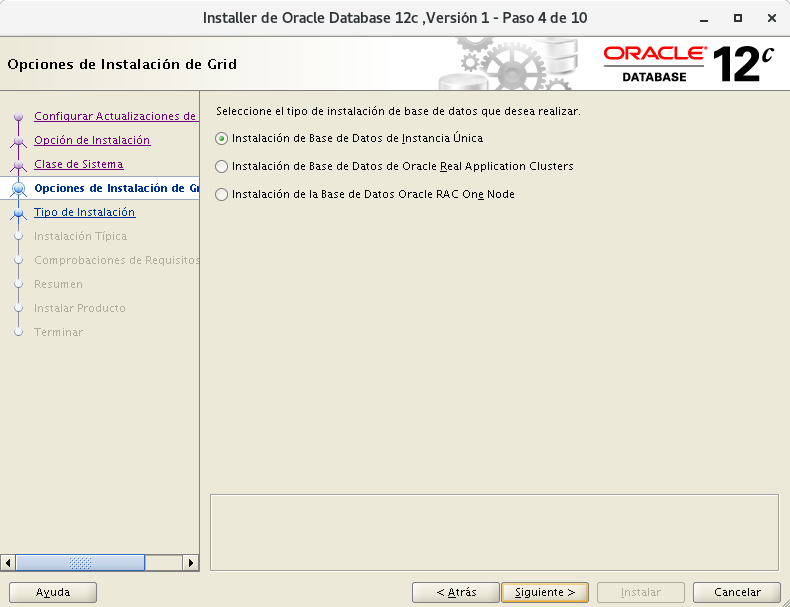
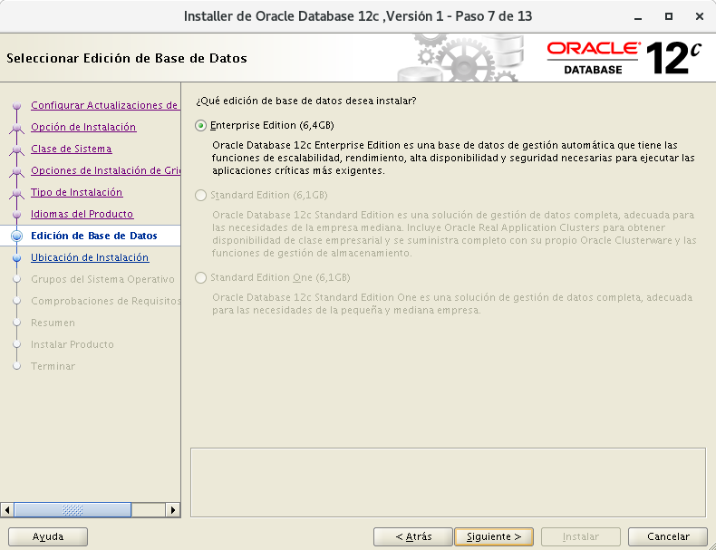
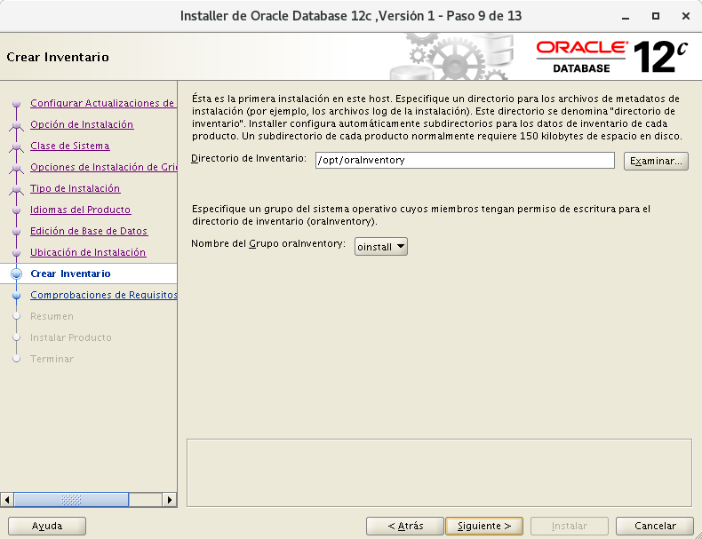
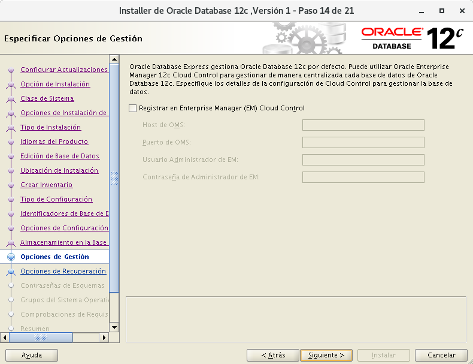
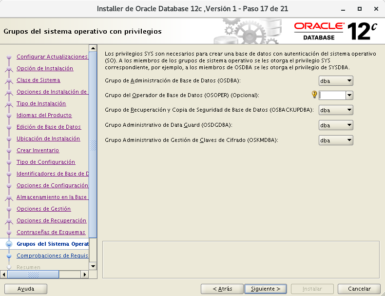
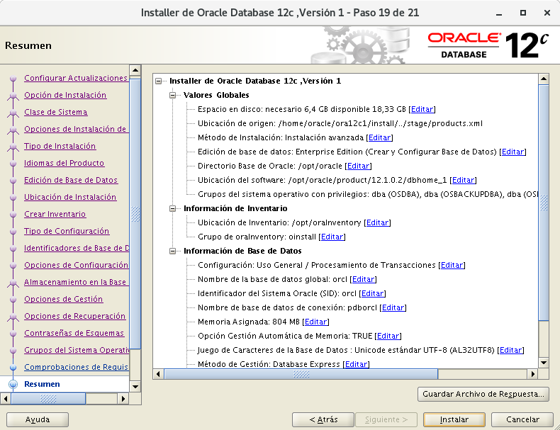
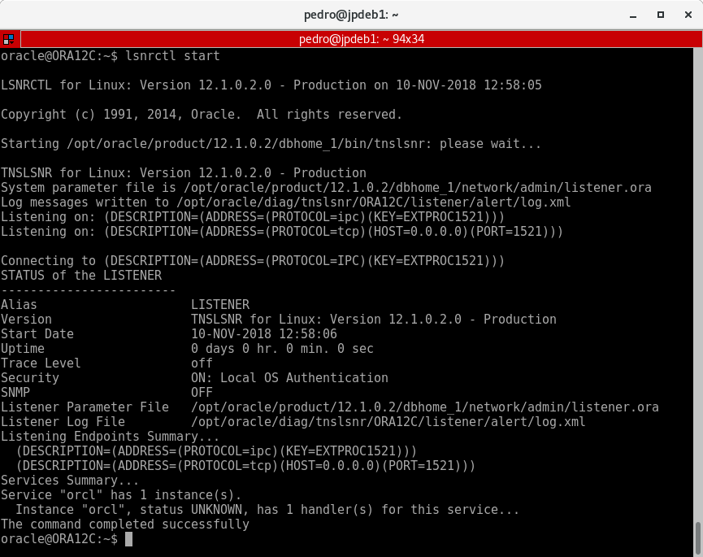

# Instalación Oracle Database 12c versión 1(12.1.0) Enterprise Edition en Debian Jessie 8.11  

Y aquí llega lo que no suele ser visto con Oracle, la instalación de su software privativo de base de datos en un sistema que no está soportado, en un sistema Debian. Así es, aquí descubrimeros que entresijos tiene realizar una instalación básica en varios pasos.


## Configuración inicial de la máquina

!!! note ""
	* El espacio temporal: debe ser mayor que 500 MB. (Espacio en /tmp)
	* El espacio de intercambio: debe ser mayor que 150 MB. (SWAP)
	* El monitor: debe estar configurado para mostrar al menos 256 colores. (Tener instalado "xorg")

* Instalación de debian en VirtualBox con:
	* 30GB de disco duro
	* 2GB de RAM
	* 2 procesadores virtuales
	* ISO imagen debian-8.11.0-amd64-netinst.iso
[Debian](https://cdimage.debian.org/cdimage/archive/8.11.0/amd64/iso-cd/debian-8.11.0-amd64-netinst.iso)
	* Conexión a Internet

* Instalación de paquetes con debian-installer:
	* Utilidades estándar del sistema 
	* SSH server

* Reposistorios recomendados para debian:
``` bash
su -
echo """
############################ Debian Main Repos ############################
deb http://deb.debian.org/debian/ oldstable main contrib non-free
deb-src http://deb.debian.org/debian/ oldstable main contrib non-free

deb http://deb.debian.org/debian/ oldstable-updates main contrib non-free
deb-src http://deb.debian.org/debian/ oldstable-updates main contrib non-free

deb http://deb.debian.org/debian-security oldstable/updates main
deb-src http://deb.debian.org/debian-security oldstable/updates main

deb http://ftp.debian.org/debian jessie-backports main
deb-src http://ftp.debian.org/debian jessie-backports main
##########################################################################
""" > /etc/apt/sources.list
```
Actualizamos la lista de paquetes y el sistema:
``` bash
apt update && apt -y upgrade
```

## Configuración inicial personalizada para Oracle

* Se suele sugerir la siguiente estructura de grupos y usuarios:
``` bash
addgroup --system oinstall
addgroup --system dba
adduser --system --ingroup oinstall -shell /bin/bash oracle
adduser oracle dba
passwd oracle
```

* Creación de directorios requeridos por Oracle:
``` bash
mkdir -p /opt/oracle/product/12.1.0.2
mkdir -p /opt/oraInventory
chown -R oracle:dba /opt/ora*
```

* Para instalar oracle se necesitan crear los siguientes enlaces:
``` bash
ln -s /usr/bin/awk /bin/awk
ln -s /usr/bin/basename /bin/basename
ln -s /usr/bin/rpm /bin/rpm
ln -s /usr/lib/x86_64-linux-gnu /usr/lib64
```

* Calcular valores limites en el sistema:
``` bash
free -b | grep -Ei 'mem:' | awk '{print $2}' ## kernel.shmmax -1
getconf PAGE_SIZE ## kernel.shmmni
kernel.shmmax -1 / kernel.shmmni ## kernel.shmall
```

* Límites en el sistema (por seguridad):
``` bash
echo """
## Valor del número máximo de manejadores de archivos. ##
fs.file-max = 65536
fs.aio-max-nr = 1048576
## Valor de los parámetros de semáforo en el orden listado. ##
## semmsl, semmns, semopm, semmni ##
kernel.sem = 250 32000 100 128
## Valor de los tamaños de segmento de memoria compartida. ##
## (Oracle recomienda total de RAM -1 byte) 2GB ##
kernel.shmmax = 2107670527
kernel.shmall = 514567
kernel.shmmni = 4096
## Valor del rango de números de puerto. ##
net.ipv4.ip_local_port_range = 1024 65000
## Valor del número gid del grupo dba. ##
vm.hugetlb_shm_group = 114
## Valor del número de páginas de memoria. ##
vm.nr_hugepages = 64
""" > /etc/sysctl.d/local-oracle.conf
```
!!! attention "Atención"
	Importante que `vm.hugetlb_shm_group` sea el GID del grupo `dba`.
	``` bash
		cat /etc/group | grep dba
	```

Cargamos la configuración al sistema:
``` bash
sysctl -p /etc/sysctl.d/local-oracle.conf
```  
También creamos esta configuración por seguridad:
``` bash
echo """
## Número máximo de procesos disponibles para un solo usuario. ##
oracle          soft    nproc           2047
oracle          hard    nproc           16384
## Número máximo de descriptores de archivo abiertos para un solo usuario. ##
oracle          soft    nofile          1024
oracle          hard    nofile          65536
## Cantidad de RAM para el uso de páginas de memoria. ##
oracle          soft    memlock         204800
oracle          hard    memlock         204800
""" > /etc/security/limits.d/local-oracle.conf
```

* Variables de entorno para Oracle:
``` bash
echo """
## Nombre del equipo ##
export ORACLE_HOSTNAME=localhost
## Usuario con permiso en archivos Oracle. ##
export ORACLE_OWNER=oracle
## Directorio que almacenará los distintos servicios de Oracle. ##
export ORACLE_BASE=/opt/oracle
## Directorio que almacenará la base de datos Oracle. ##
export ORACLE_HOME=/opt/oracle/product/12.1.0.2/dbhome_1
## Nombre único de la base de datos. ##
export ORACLE_UNQNAME=oraname
## Identificador de servicio de escucha. ##
export ORACLE_SID=orasid
## Ruta a archivos binarios. ##
export PATH=$PATH:/opt/oracle/product/12.1.0.2/dbhome_1/bin
## Ruta a la biblioteca. ##
export LD_LIBRARY_PATH=/opt/oracle/product/12.1.0.2/dbhome_1/lib
## Idioma
export NLS_LANG='SPANISH_SPAIN.AL32UTF8'
""" >> /etc/bash.bashrc
```

* Cargamos las variables de entorno:
``` bash
source /etc/bash.bashrc
```

!!! attention "Atención"
	Importante establecer correctamente las variables de entorno.

* Configuración idioma sistema para instalación en español:
``` bash
dpkg-reconfigure locales
```

Elegimos `es_ES.UTF-8 UTF-8`.

* Instalación de paquetes necesarios:
``` bash
apt -y install build-essential binutils libcap-dev gcc g++ libc6-dev ksh libaio-dev make libxi-dev libxtst-dev libxau-dev libxcb1-dev sysstat rpm xauth xorg unzip
```

## Descargas de Oracle Database Software

!!! note ""
	Esta acción la realizaremos en el equipo anfitrión con entorno gráfico.

Link para descarga:
[Oracle](https://www.oracle.com/technetwork/database/enterprise-edition/downloads/index.html?ssSourceSiteId=otnes)

Primero iniciamos sesión y aceptamos el "License Agreement". Luego elegimos el siguiente:

 Oracle Database 12c Release 1  
 (12.1.0.2.0) Enterprise Edition  
 linux x86-64  	File 1  (3.2 GB)  

* Descomprimimos el zip:
Abrimos consola y nos situamos en el directorio de la descarga:
``` bash
cd Descargas
unzip linuxx64_12102_database.zip
```

* Pasamos lo descomprimido a la máquina virtual:  
Aparecerá una carpeta `database`, esa carpeta la copiaremos mediante `scp` a la máquina virtual:
``` bash
scp -r database/ oracle@192.168.1.25:
```

## Instalación de Oracle

* Ejecutaremos mediante `ssh` y `X11forward` el instalador de Oracle con entorno gráfico:
``` bash
ssh -XC oracle@192.168.1.25
database/runInstaller -IgnoreSysPreReqs -ignorePrereq
```
!!! note ""
	La opción `-IgnoreSysPreReqs` es para que ignorar los prerequisitos del sistema.  
	La opción -X ejecuta aplicaciones gráficas.  
	La opción -C es para comprimir los datos de la conexión.  

***
* Configurar Actualizaciones de Seguridad

Demarcamos la casilla para recibir actualizaciones y continuamos con `Siguiente >`.


***
Nos aparecerá una ventana para decirnos que Oracle no está soportado para este sistema
y que el instalador no realizará las comprobaciones de requisitos en el sistema,
la ignoramos y continuamos diciendo `Sí`.


***
* Seleccionar Opción de Instalación

Elegimos la opción para "Crear y configurar base de datos" ya que vamos a crear una nueva base de datos y continuamos con `Siguiente >`.


***
* Clase de Sistema

Elegimos la opción "Clase de Servidor" y continuamos con `Siguiente >`.


***
* Opciones de Instalción de Grid

Elegimos "Instalación de Base de Datos de Instancia Única"  y continuamos con `Siguiente >`.



***
* Tipo de Instalación

Elegimos Avanzada para configurar mas a fondo.


***
* Idiomas

Dejamos por defecto.


***
* Edición de Base de Datos

Solo nos deja Enterprise Edition.



***
* Ubicación de Instalación

Si tenemos bien definidas las variavles de entorno se configura automáticamente.


***
* Crear Inventario

Si tenemos bien definidas las variavles de entorno se configura automáticamente.



***
* Tipo de COnfiguración

Para Uso General.


***
* Especificar Identificadores de Base de Datos

Dejamos valores por defecto.


***
* Opciones de Configuración

En "Juego de Caracteres" elegimos "Unicode".


Y en "Esquemas de Ejemplo" marcamos la casilla para crear la base de datos con esquemas de ejemplo.


***
* Almacenamiento en la base de datos

Dejamos por defecto.


***
* Opciones de Gestión

Saltamos este paso y continuamos con `Siguiente >`.



***
* Opciones de Recuperación

Saltamos este paso y continuamos con `Siguiente >`.


***
* Contraseñas de Esquemas

Para mayor comodidad usamos la misma contraseña para todas las cuentas. Además Oracle recomienda una contraseña de al menos 8 caracteres, al menos una en mayúscula, otra en minúscula y al menos un carácter alfanumérico.


***
* Grupos del Sistema Operativo con privilegios

Dejamos por defecto.



***
* Resumen de Instalación

Aquí vemos la configuración final de la instalación para poder comprobar si tenemos algún error.
Seleccionamos "Instalar".



***
* Instalar Producto

Este paso tardará algunos minutos.


***
* Ejecutar Scripts de Configuración

Finalizando la instalación Oracle nos pide que ejecutemos unos scripts como ROOT:

``` bash
/opt/oraInventory/orainstRoot.sh
/opt/oracle/product/12.2.0/dbhome_1/root.sh
```


***
* Asistente de Configuración de base de Datos

Al finalizar la ejecución de los scripts pulsamos `Aceptar` y comenzará el proceso de creación de la base de datos que tardará aún mas tiempo que la instalación del software. Así que a esperar...


***
* Fin Configuración

Pasados bastantes minutos Oracle nos muestra alguna información de la base de datos como la URL de "Enterprise Manager Database Express" en:

``` bash
https://localhost:5500/em
```

Para acceder a dicha aplicación web necesitaremos tener instalado Adobe Flash Player y aceptar la excepción de seguridad de esa página. 

!!! note ""
	Los accesos desde otras redes están abiertas por defecto.	
	`https://192.168.1.25:5500/em`

Aceptamos.


***
* Fin de la instalación


## Accediendo a la base de datos

El acceso a la base de datos lo realizaremos mediante línea de comandos con "sqlplus".

Podemos instalar un paquete que nos ayudará con un uso mas amigable de "sqlplus":

``` bash
apt install rlwrap
```

Accedemos a la base de datos:

``` bash
rlwrap sqlplus sys/PASS as sysdba
```

Ejecutamos consulta para ver la versión de Oracle:

``` sql
select * from v$version;
```


!!! note "Para poder crear usuarios ejecutamos lo siguiente:"
	`alter session set "_ORACLE_SCRIPT"=true;`  
	-\ \ \ \ \ \ -Ó    
	`echo 'alter session set "_ORACLE_SCRIPT"=true;' >> $ORACLE_HOME/sqlplus/admin/glogin.sql` 


## Iniciación de la base de datos

Por defecto si reinicio la máquina no arranca oracle asi que de momento la arrancaremos manualmente:

* Estado del Listener

``` bash
lsnrctl status
```


* Arrancamos el Listener:

``` bash
lsnrctl start
```



* Arrancamos la base de datos:

``` bash
sqlplus / as sysdba
```

``` sql
startup
```


## Configuración acceso remoto Oracle

Si necesitamos acceder mediante la red seguiremos los siguientes pasos:

* Editamos la configuración del "Listener" de oracle en `$ORACLE_HOME/network/admin/listener.ora`:
``` bash
nano $ORACLE_HOME/network/admin/listener.ora
```

* Dejamos el fichero tal que así para que puedan acceder desde cualquier red:
``` bash hl_lines='17'
SID_LIST_LISTENER =
 (SID_LIST =
  (SID_DESC =
   (GLOBAL_DBNAME = orcl)
   (ORACLE_HOME = /opt/oracle/product/12.1.0.2/dbhome_1)
   (SID_NAME = orcl)
  )
 )

LISTENER=
 (DESCRIPTION_LIST =
  (DESCRIPTION =
   (ADDRESS_LIST =
    (ADDRESS = (PROTOCOL = IPC)(KEY = EXTPROC1521))
   )
   (ADDRESS_LIST =
    (ADDRESS = (PROTOCOL = TCP)(HOST = 0.0.0.0)(PORT = 1521))
   )
  )
 )

```

* Reiniciamos el "Listener" con:
``` bash
lsnrctl stop
lsnrctl start
```

## Instalación de Cliente SQLPlus remoto

Lo primero será instalar `alien` el cual nos permite reempaquetar un fichero `.rpm` en `.deb`:

``` bash
apt install alien
```

Luego nos descargamos los ficheros RPM necesarios de la página de [Oracle](https://www.oracle.com/technetwork/topics/linuxx86-64soft-092277.html)

Aceptamos los términos y elegimos los siguientes paquetes:

 -- Version 12.1.0.2.0 --  
 oracle-instantclient12.1-basic-12.1.0.2.0-1.x86_64.rpm  
 oracle-instantclient12.1-sqlplus-12.1.0.2.0-1.x86_64.rpm  
 oracle-instantclient12.1-devel-12.1.0.2.0-1.x86_64.rpm  

Reempaquetamos:
``` bash
alien --to-deb --scripts oracle-instantclient12.1-*.rpm
```

Instalamos los paquetes generados:
``` bash
dpkg -i oracle-instantclient12.1-*.rpm
```

Añadimos la variabe de entorno necesaria:
``` bash
echo '''
export LD_LIBRARY_PATH=/usr/lib/oracle/12.1/client64/lib/:$LD_LIBRARY_PATH
''' >> /etc/bash.bashrc
```

Ya podemos usar SQLPlus remotamente:
``` bash
sqlplus64 system/PASS@//192.168.1.25:1521/orcl
```


Y con esto y un bizcocho se acabó Oracle!!   
De momento...

## Enlaces de Interés

[Oracle Oficial][1]  
[Wiki Debian][2]  
[debian-administration][3]  
[oracle-base][4]  
[dbaora][5]  
[gemsofprogramming][6]  
[Oracle Oficial 10g][7]  
[Blog juanjo][8]  
[Blog Aitor][9]

 [1]: https://docs.oracle.com/database/121/LADBI/toc.htm
 [2]: https://wiki.debian.org/DataBase/Oracle
 [3]: https://debian-administration.org/article/656/Installing_Oracle11_and_Oracle12_on_Debian_Wheezy_Squeeze
 [4]: https://oracle-base.com/articles/12c/oracle-db-12cr1-installation-on-oracle-linux-7
 [5]: http://dbaora.com/install-oracle-12cr1-on-oel7/
 [6]: https://gemsofprogramming.wordpress.com/2013/09/19/installing-oracle-12c-on-ubuntu-12-04-64-bit-a-hard-journey-but-its-worth-it/
 [7]: https://docs.oracle.com/html/B14402_01/qig_master.htm#BAGGEBGG
 [8]: https://juanjoselo.wordpress.com/2017/10/25/instalacion-y-configuracion-de-oracle-12c-en-debian-8-jessie/
 [9]: https://openbinary20.com/2016/11/10/instalacion-y-configuracion-de-oracle-12c-en-debian-jessie/
