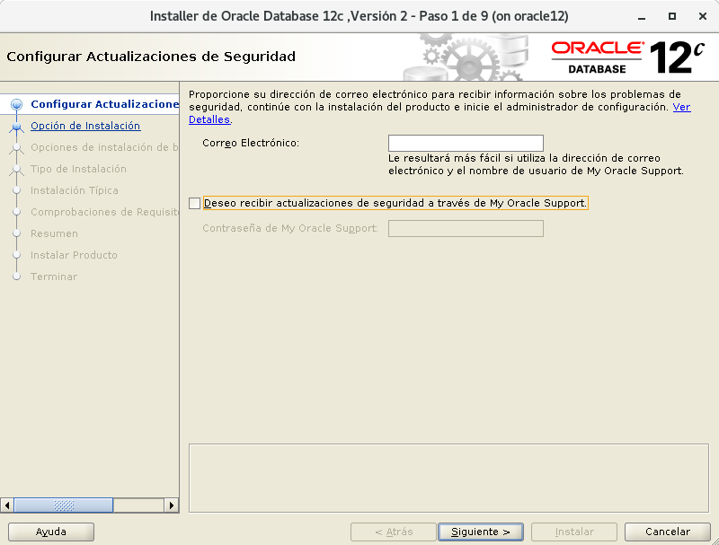
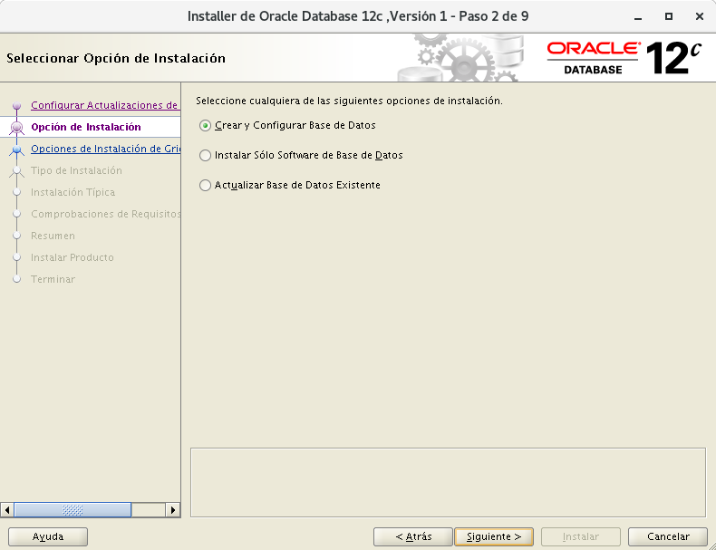
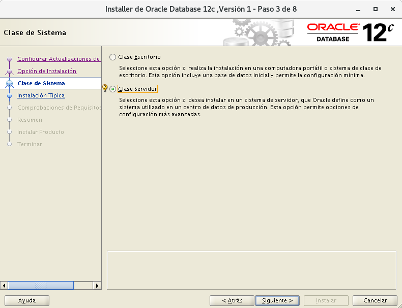
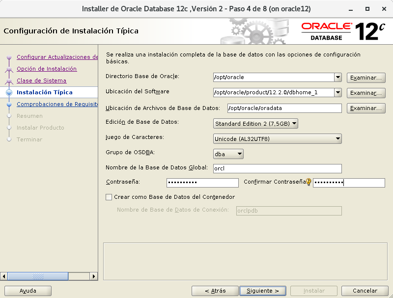
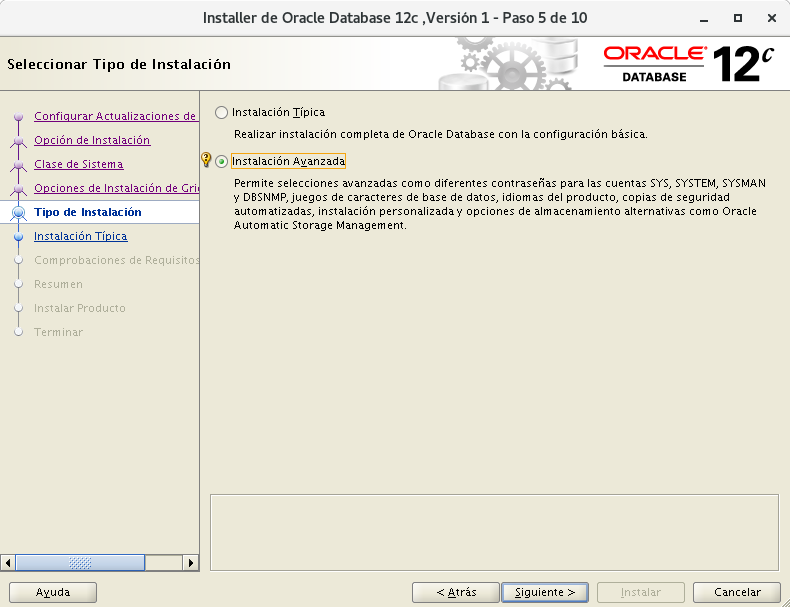
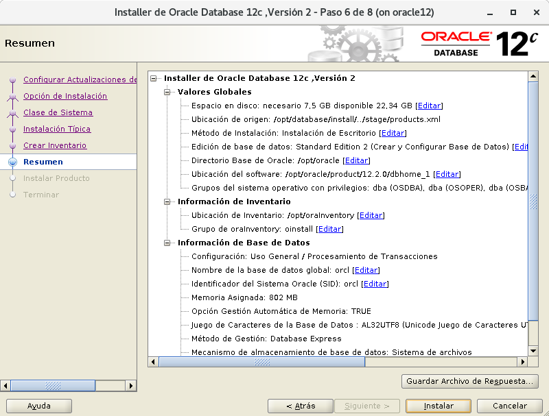
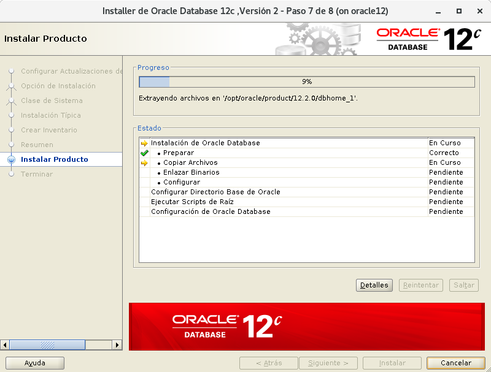
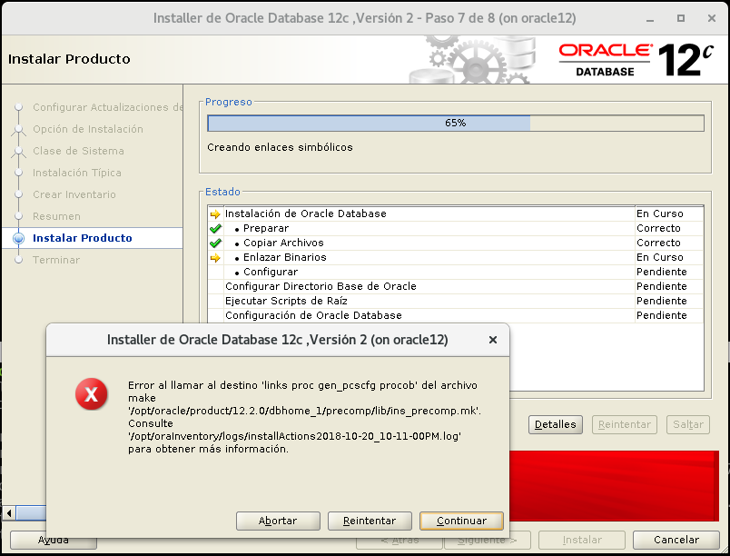

# Instalación Oracle Database 12c versión 2(12.2.0) Enterprise Edition en Debian Jessie 8.11
{#cabecera1}
Y aquí llega lo que no suele ser visto con Oracle, la instalación de su base de datos en un sistema que no está soportado por este software privativo en un Debian. Así es, aquí descubrimeros que entresijos tiene realizar esta instalación un poco dificultosa en varios pasos.


## Configuración inicial de la máquina.

!!! note ""
	* El espacio temporal: debe ser mayor que 500 MB. (Espacio en /tmp)
	* El espacio de intercambio: debe ser mayor que 150 MB. (SWAP)
	* El monitor: debe estar configurado para mostrar al menos 256 colores. (Tener instalado "xorg")

* Instalación de debian en VirtualBox con:
	* 40GB de disco duro
	* 2GB de RAM
	* 2 procesadores virtuales
	* ISO imagen debian-8.1.0-amd64-netinst.iso
[Debian](https://cdimage.debian.org/cdimage/archive/8.11.0/amd64/iso-cd/debian-8.11.0-amd64-netinst.iso)
	* Internet

* Particionado:
	* 9GB -- Sistema raíz -- /
	* 29GB -- Instalción de oracle -- /opt
	* 2GB -- SWAP

* Instalación de paquetes con debian-installer:
	* Utilidades estándar del sistema 
	* SSH server

* Reposistorios recomendados para debian:
``` bash
su -
echo """
############################ Debian Main Repos ############################
deb http://deb.debian.org/debian/ stable main contrib non-free
deb-src http://deb.debian.org/debian/ stable main contrib non-free

deb http://deb.debian.org/debian/ stable-updates main contrib non-free
deb-src http://deb.debian.org/debian/ stable-updates main contrib non-free

deb http://deb.debian.org/debian-security stable/updates main
deb-src http://deb.debian.org/debian-security stable/updates main

deb http://ftp.debian.org/debian stretch-backports main
deb-src http://ftp.debian.org/debian stretch-backports main
##########################################################################
""" > /etc/apt/sources.list
```
Actualizamos la lista de paquetes y el sistema:
``` bash
apt update && apt upgrade
```

## Configuración inicial personalizada para Oracle.

* Se suele sugerir la siguiente estructura de grupos y usuarios:
``` bash
addgroup --system oinstall
addgroup --system dba
adduser --system --ingroup oinstall -shell /bin/bash oracle
adduser oracle dba
passwd oracle
```

* Creación de directorios requeridos por Oracle:
``` bash
mkdir -p /opt/oracle/product/12.1.0
mkdir -p /opt/oraInventory
chown -R oracle:dba /opt/
```

* Para instalar oracle se necesitan crear los siguientes enlaces:
``` bash
ln -s /usr/bin/awk /bin/awk
ln -s /usr/bin/basename /bin/basename
ln -s /usr/bin/rpm /bin/rpm
ln -s /usr/lib/x86_64-linux-gnu /usr/lib64
```

* Límites en el sistema (por seguridad):
``` bash
echo """
## Valor del número máximo de manejadores de archivos. ##
fs.file-max = 65536
fs.aio-max-nr = 1048576
## Valor de los parámetros de semáforo en el orden listado. ##
## semmsl, semmns, semopm, semmni ##
kernel.sem = 250 32000 100 128
## Valor de los tamaños de segmento de memoria compartida. ##
## (Oracle recomienda total de RAM -1 byte) 2GB ##
kernel.shmmax = 2147483648
kernel.shmall = 2097152
kernel.shmmni = 4096
## Valor del rango de números de puerto. ##
net.ipv4.ip_local_port_range = 1024 65000
## Valor del número gid del grupo dba. ##
vm.hugetlb_shm_group = 112
## Valor del número de páginas de memoria. ##
vm.nr_hugepages = 64
""" > /etc/sysctl.d/local-oracle.conf
```
Cargamos la configuración al sistema:
``` bash
sysctl -p /etc/sysctl.d/local-oracle.conf  
```  
También creamos esta configuración por seguridad:
``` bash
echo """
## Número máximo de procesos disponibles para un solo usuario. ##
oracle          soft    nproc           2047
oracle          hard    nproc           16384
## Número máximo de descriptores de archivo abiertos para un solo usuario. ##
oracle          soft    nofile          1024
oracle          hard    nofile          65536
## Cantidad de RAM para el uso de páginas de memoria. ##
oracle          soft    memlock         204800
oracle          hard    memlock         204800
""" > /etc/security/limits.d/local-oracle.conf
```

* Variables de entorno para Oracle:
``` bash
echo """
## Nombre del equipo ##
export ORACLE_HOSTNAME=localhost
## Usuario con permiso en archivos Oracle. ##
export ORACLE_OWNER=oracle
## Directorio que almacenará los distintos servicios de Oracle. ##
export ORACLE_BASE=/opt/oracle
## Directorio que almacenará la base de datos Oracle. ##
export ORACLE_HOME=$ORACLE_BASE/product/12.2.0/dbhome_1
## Nombre único de la base de datos. ##
export ORACLE_UNQNAME=ORA12C
## Identificador de servicio de escucha. ##
export ORACLE_SID=ORA12C
## Ruta a archivos binarios. ##
export PATH=$PATH:$ORACLE_HOME/bin
## Ruta a la biblioteca. ##
export LD_LIBRARY_PATH=$LD_LIBRARY_PATH:/usr/lib/x86_64-linux-gnu:/bin/lib:/lib/x86_64-linux-gnu/:/usr/lib64
""" >> /etc/bash.bashrc
```

* Instalación de paquetes necesarios:
``` bash
apt install build-essential binutils libcap-dev gcc g++ libc6-dev ksh libaio-dev make libxi-dev libxtst-dev libxau-dev libxcb1-dev sysstat rpm xauth xorg unzip
```

## Descargas de Oracle Database Software.

!!! note ""
	Esta acción la realizaremos en el equipo anfitrión con entorno gráfico.

Link para descarga:
[Oracle](https://www.oracle.com/technetwork/database/enterprise-edition/downloads/index.html?ssSourceSiteId=otnes)

Primero iniciamos sesión y aceptamos el "License Agreement". Luego elegimos el siguiente:

 Oracle Database 12c Release 2 (12.2.0.1.0)  
 Standard Edition 2 and Enterprise Edition  
 linux x86-64  	File 1  (3.2 GB)  

* Descomprimimos el zip:
Abrimos consola y nos situamos en el directorio de la descarga:
``` bash
cd Descargas
unzip linuxx64_12201_database.zip
```

* Pasamos lo descomprimido a la máquina virtual:  
Aparecerá una carpeta `database`, esa carpeta la copiaremos mediante `scp` a la máquina virtual:
``` bash
scp -r database/ oracle@192.168.1.25:
```

## Instalación de Oracle:

* Ejecutaremos mediante `ssh` y `X11forward` el instalador de Oracle con entorno gráfico:
``` bash
ssh -XC oracle@192.168.1.25 /opt/database/runInstaller -IgnoreSysPreReqs
```
!!! note ""
	La opción `-IgnoreSysPreReqs` es para que ignorar los prerequisitos del sistema.  
	La opción -X ejecuta aplicaciones gráficas.  
	La opción -C es para comprimir los datos de la conexión.  

***
Nos aparecerá una ventana para decirnos que Oracle no está soportado para este sistema
y que el instalador no realizará las comprobaciones de requisitos en el sistema,
la ignoramos y continuamos diciendo `Sí`.


***
* Configurar Actualizaciones de Seguridad

Demarcamos la casilla para recibir actualizaciones y continuamos con `Siguiente >`.




***
* Seleccionar Opción de Instalación

Elegimos la opción para "Crear y configurar base de datos" ya que vamos a crear una nueva base de datos y continuamos con `Siguiente >`.




***
* Clase de Sistema

Elegimos la opción "Clase de Escritorio" ya que de momento no vamos a utilizar las opciones avanzadas que nos ofrece Oracle como "Oracle RAC, la gestión automática de almacenamiento, configuración de copia de seguridad..." y continuamos con `Siguiente >`.




***
* Configuración de Instalación Típica

Aquí tendremos que configurar varias cosas:  
 - Directorio Base de Oracle: `/opt/oracle`.  
 - Ubicación del Software: `/opt/oracle/product/12.2.0/dbhome_1`.  
 - Ubicación de Archivos de Bases de Datos: `/opt/oracle/oradata`.  
 - Edición de Base de Datos: `Standard Edition 2` para grupos de trabajo o pequeñas empresas.  
 - Juego de Caracteres: `Unicode AL32UTF8`.  
 - Grupo de OSDBA: `dba`.  
 - Nombre de la Base de Datos Global: `orcl`.  
 - Contraseña Administrativa (SYS): **********.  
 - Crear como Base de Datos de Contenedor: Desmarcamos ya que no vamos a conectarnos a otra.  

Continuamos con `Siguiente >`.




***
* Crear Inventario

 -Directorio de Inventario de Oracle: `/opt/oraInventory`  
 -Grupo de Inventario de Oracle: `oinstall`  

Continuamos con `Siguiente >`.




***
* Resumen  

Aquí veremos el resumen de la configuración de la instalación por si queremos revisarlo.

Procedemos a `Instalar`.






***
* Errores en la instalación

En mi caso me encuentro varios errores enlazando los binarios y me sale esta ventana:



Lo que hago es mirar al final del fichero log, que nos indica en el mensaje, y averiguar que ocurre.

Abro temrinal y ejecuto:

``` bash
ssh oracle@192.168.1.25
```

Leemos el final del log:
``` bash
tail -40 /opt/oraInventory/logs/installActions2018-10-20_10-11-00PM.log
```

En una linea nos indica lo siguiente:
`/bin/chmod: no se puede acceder a '/opt/oracle/product/12.2.0/dbhome_1/precomp/lib/proc': No existe el fichero o el directorio`

Así que crearemos ese directorio a mano:
``` bash
mkdir -p /opt/oracle/product/12.2.0/dbhome_1/precomp/lib/proc
```

Ahora pulsamos en `Reintentar` en la ventana emergente que nos apareció.

!!! note ""
	Repetiremos esto las veces que haga falta.

En mi caso estas serán las acciones que tendré que ejecutar:
``` bash
mkdir -p /opt/oracle/product/12.2.0/dbhome_1/precomp/lib/procob
mkdir -p /opt/oracle/product/12.2.0/dbhome_1/precomp/lib/proc
mkdir -p /opt/oracle/product/12.2.0/dbhome_1/precomp/lib/proc
```


***
* Configurar Actualizaciones de Seguridad

Demarcamos la casilla para recibir actualizaciones y continuamos con `Siguiente >`.


***


https://localhost:5500/em


ERRORESSS !!

mkdir /opt/oracle/product/12.2.0/dbhome_1/precomp/lib/proc
chown oracle:oinstall /opt/oracle/product/12.2.0/dbhome_1/precomp/lib/proc


##

During the linking phase, you will see the following error.

Error in invoking target 'links proc gen_pcscfg procob' of makefile
'/u01/app/oracle/product/12.1.0.1/db_1/precomp/lib/ins_precomp.mk'.
See
'/u01/app/oraInventory/logs/installActions2014-04-26_08-07-04PM.log'
for details.

To fix it, do the following:

rm -rf $ORACLE_HOME/lib/stubs/*
cp $ORACLE_HOME/rdbms/lib/env_rdbms.mk $ORACLE_HOME/rdbms/lib/env_rdbms.mk.orig

Perform the following modifications to the "$ORACLE_HOME/rdbms/lib/env_rdbms.mk" file.

## Line 176
## FROM:
LINKTTLIBS=$(LLIBCLNTSH) $(ORACLETTLIBS) $(LINKLDLIBS)
## TO  :
LINKTTLIBS=$(LLIBCLNTSH) $(ORACLETTLIBS) $(LINKLDLIBS) -lons

## Line 279-280
## FROM:
LINK=$(FORT_CMD) $(PURECMDS) $(ORALD) $(LDFLAGS) $(COMPSOBJS)
LINK32=$(FORT_CMD) $(PURECMDS) $(ORALD) $(LDFLAGS32) $(COMPSOBJS)
## TO  :
LINK=$(FORT_CMD) $(PURECMDS) $(ORALD) $(LDFLAGS) $(COMPSOBJS) -Wl,--no-as-needed
LINK32=$(FORT_CMD) $(PURECMDS) $(ORALD) $(LDFLAGS32) $(COMPSOBJS) -Wl,--no-as-needed

## Line 3041-3042
## FROM:
TG4PWD_LINKLINE= $(LINK) $(OPT) $(TG4PWDMAI) \
        $(LLIBTHREAD) $(LLIBCLNTSH) $(LINKLDLIBS)
## TO  :
TG4PWD_LINKLINE= $(LINK) $(OPT) $(TG4PWDMAI) \
        $(LLIBTHREAD) $(LLIBCLNTSH) $(LINKLDLIBS) -lnnz12


##


Error al llamar al destino 'install' del archivo make '/opt/oracle/product/12.2.0/dbhome_2/ctx/lib/ins_ctx.mk'. Consulte '/opt/oraInventory2/logs/installActions2018-10-20_11-30-33PM.log' para obtener más información.

Error al llamar al destino 'install' del archivo make '/opt/oracle/product/12.2.0/dbhome_2/plsql/lib/ins_plsql.mk'. Consulte '/opt/oraInventory2/logs/installActions2018-10-20_11-30-33PM.log' para obtener más información.

Error al llamar al destino 'all_no_orcl' del archivo make '/opt/oracle/product/12.2.0/dbhome_2/rdbms/lib/ins_rdbms.mk'. Consulte '/opt/oraInventory2/logs/installActions2018-10-20_11-30-33PM.log' para obtener más información.

Error al llamar al destino 'utilities' del archivo make '/opt/oracle/product/12.2.0/dbhome_2/rdbms/lib/ins_rdbms.mk'. Consulte '/opt/oraInventory2/logs/installActions2018-10-20_11-30-33PM.log' para obtener más información.

Error al llamar al destino 'irman ioracle rat_off dm_off olap_off part_off' del archivo make '/opt/oracle/product/12.2.0/dbhome_2/rdbms/lib/ins_rdbms.mk'. Consulte '/opt/oraInventory2/logs/installActions2018-10-20_11-30-33PM.log' para obtener más información.


###


[Enlace 1][1], [Enlace 2][2], [Enlace 3][3]

 [1]: http://joedicastro.com/consejos
 [2]: http://joedicastro.com/consejos "Consejos"
 [3]: http://joedicastro.com/


apt-get install default-jdk ### no estoy seguro

dpkg --add-architecture i386 ### no creo que haga falta


